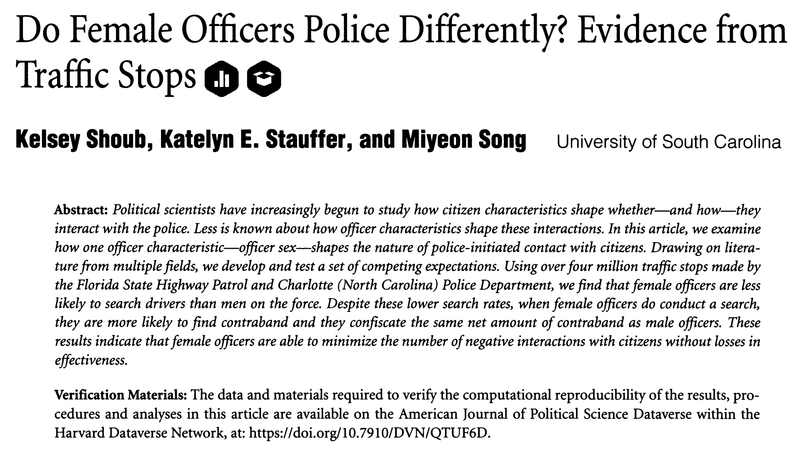



## Today's dataset



## We'll start by reading in the data

```{webr}
officerdata <- read.csv('officers.csv')
head(officerdata) # head() shows the first six rows of a longer dataset.
```

:::{.notes}
search_occur: whether or not a search was conducted by the officer at that stop

contra: whether or not contraband was found by the officer at that stop

driver_age: age of driver (years)

driver_race: race of driver (white, poc)

officer_female: officer gender
:::

# What if we just want data on stops by female officers?

## We need to *subset* our data

Like this:

`name.of.new.subset.dataset <- subset(original.dataset, original.dataset$variable.in.dataset == accepted.value)`

- Note `==`! This is a **boolean operator**
- If the variable is a **string,** wrap accepted.value in quotations, like this: `== 'accepted.value'`

## Remember our `belchers` dataset:

```{webr}
#| edit: false
#| autorun: true
#| echo: false
belchers <- read.csv('belchers.csv')
belchers
```

Let's subset to Belchers 18 and up:

```{webr}
# subset(original.dataset, original.dataset$variable.in.dataset == accepted.value)
adult.belchers <- 
adult.belchers
```

:::{.notes}
adult.belchers is an entirely new dataset, and we can do all the things with it that we could do to belchers.
:::

## How would we subset to only Belchers who are students?

```{r, echo = F}
belchers <- read.csv('belchers.csv')
belchers
```

```{webr}
student.belchers <- 
student.belchers
```

:::{.notes}
Note use of quotes around "Student"!
:::

## A more serious example

Let's subset `officerdata` to look at the data specifically from traffic stops by female officers.

(Remember: `officer_female` is a binary indicator.)

```{webr}
#| edit: false
#| autorun: true
#| echo: false
officerdata <- read.csv('officers.csv')
```

```{webr}
female.officer.stops <- 
head(female.officer.stops)
```

:::{.notes}
subset(officerdata, officerdata$officer_female==1)
:::

## Gathering statistics: Using `mean()` within a subset

Let's compare the means of contrabands found among stops between male and female officers.

```{webr}
#| edit: false
#| autorun: true
#| echo: false
officerdata <- read.csv('officers.csv')
```

```{webr}
female.officer.stops <- subset(officerdata, officerdata$officer_female == 1)
mean(female.officer.stops$contra)
```

```{webr}
male.officer.stops <- 
mean(male.officer.stops$contra)
```