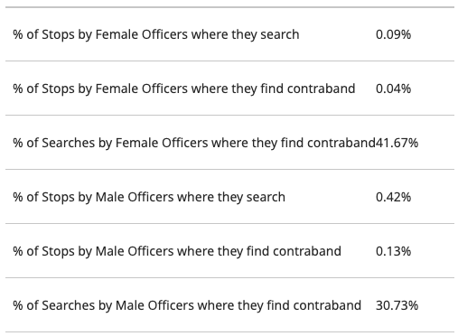



## Viewing feedback on your Thursday notebooks

- Go to Gradescope (links in Brightspace)
- Click into the assignment you want to view
- To view the submission itself, click 'Code' and click on the .ipynb file
- The right-hand sidebar will show your points per question
- Click into a question to view feedback on open-ended questions where you lost points

## Last Thursday, Q4 was tough {.smaller}

:::{.columns}
:::{.column width=50%}

:::
:::{.column width=50%}
**Question 4.** Suppose you work in the Mayor's office of a City and are trying to evaluate the performance of individual police officers. Do you think the proportion of stops where officers find contraband, or the proportions of searches where they find contraband, are a good indicator of the effectiveness/performance of police officers? Why or why not? **What are the pros and cons of these metrics?**
:::
:::

# Today: tabulating your data in R

## When to use tables

- A useful tool for summarizing your data
- Especially with **categorical variables**
  - *e.g.,* the variable `color` could contain categorical values like "blue" and "red"
- Categorical variables can also summarize **continuous variables**
  - *e.g.,* we often have an `age` variable but also categorize people using an `age_group` variable
  
## Today's dataset

```{webr}
happiness_data <- read.csv('happiness_polity_2018.csv')
head(happiness_data)
```

## Codebook (also in your notebook!)

```{r}
library(knitr)
library(kableExtra)

vars <- data.frame(
  Variable = c(
    "polity2", "polity2_cat", "gdpcapita", "gdpcapita_cat",
    "happiness", "happiness_cat", "life_expectancy", "life_expectancy_cat"
  ),
  Description = c(
    "Polity Score: 21-point scale from -10 (hereditary monarchy) to +10 (consolidated democracy)",
    "Political category: autocracies, anocracies (semi-democracies), or democracies",
    "GDP per capita (economic output per person)",
    "Income category based on GDP per capita",
    "Happiness index from surveys on quality-of-life factors",
    "Happiness category based on the happiness index",
    "Average life expectancy, in years",
    "Life expectancy category based on the life expectancy value"
  )
)

kable(vars, format = "html", col.names = c("Variable", "Description")) %>%
  kable_styling(font_size = 18, full_width = FALSE) %>%
  column_spec(1, monospace = TRUE, width = "3cm") %>%
  column_spec(2, width = "9cm")
```

:::{.notes}
This dataset contains data from countries around the world on phenomena including happiness levels, political categories, and demographic information.

polity2: The "Polity Score" of the country, which measures its political system on a 21-point scale ranging from -10 (hereditary monarchy) to +10 (consolidated democracy).

polity2_cat: The political category the country is identified within. "autocracies" are on one end of the spectrum, "anocracies" are in the middle (semi-democracies), and "democracies" are at the top of the spectrum.

gdpcapita: GDP per Capita (economic output per person)

gdpcapita_cat: GDP/income category that the country falls into (based on GDP per capita)

happiness: The country's happiness index, measured through surveys that require participants to rank their level of happiness based on an assortment of quality-of-life factors

happiness_cat: Happiness category that the country falls into (based on happpiness indicator)

life_expectancy: Average life expectancy in years

life_expectancy_cat: Life Expectancy category that the country falls into
:::

## One-way tables

- Also called **frequency tables**
- Give us *counts* of each specific category that is present in a dataset
- Also useful for understanding what values any type of variable has when you first open an unfamiliar dataset
- R command looks like this: `table(dataset.name$variable.name)`

## One-way tables

```{webr}
# how many countries in our dataset fall into each income category?
table(happiness_data$gdpcapita_cat)
```


:::{.fragment}
What would happen if we used `gdpcapita` instead of `gdpcapita_cat`?
:::

## How about political categories?

Let's make a one-way table using the `polity2_cat` variable in `happiness_data.`

```{webr}

```

:::{.fragment}

Using what we covered last week, how would we look at the political categories only among rich countries (*i.e.,* where `gdpcapita_cat` is equal to `'rich'`)?
:::


# What about relationships *between* variables?

## Science in the abstract

- Most scientific research is about relationships between variables
- We have a **theory** about how variables fit together
- We develop **hypotheses** --- testable propositions that should hold if the theory is true
- We find data that allow us to test our hypotheses
- Based on the results, we re-evaluate our theory

## The theory we will test today

> "As countries develop economically, citizens start demanding more democracy."

- How would we translate this into a hypothesis we can test with our dataset?
- We are going to have to look at two variables at once...

## Two-way tables {.smaller}

- Command looks like `table(dataset.name$row.variable.name, dataset.name$column.variable.name)` (think **R**ay **C**harles)
- Let's group GDP categories with political categories to see how many countries fit into each of the groupings:

:::{.fragment}
```{webr}
table(happiness_data$polity2_cat, happiness_data$gdpcapita_cat)
```
:::

:::{.fragment}
Is this good evidence for the theory that economic development causes countries to become more democratic?
:::

## P.S. Tables can be stored in variables!

You will be storing the results of tables in variables in your assignments so they can be autograded. It does work!

```{webr}
happiness.by.gdp <- table(happiness_data$polity2_cat, 
                          happiness_data$gdpcapita_cat)
```

```{webr}
happiness.by.gdp
```

## What we have covered

- Tables are useful for (1) exploring datasets and (2) examining categorical variables
- `table(dataset.name$variable.name)` gives you a one-way (frequency) table
- `table(dataset.name$row.variable.name, dataset.name$column.variable.name)` gives you a two-way table
- We introduced the concepts of **theories,** **hypotheses,** and **empirical tests** as components of the scientific process