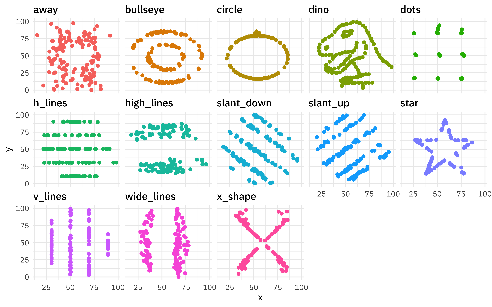



## Take two datasets

```{webr}
#| edit: false
#| autorun: true
#| echo: false
#| message: false
#| warning: false
# Load R packages we will need
library(ggplot2)
library(datasauRus)

# create datasets
a_dataset <- datasaurus_dozen[datasaurus_dozen$dataset=="away",2:3]
rownames(a_dataset) <- NULL

another_dataset <- datasaurus_dozen[datasaurus_dozen$dataset=="dino",2:3]
rownames(another_dataset) <- NULL

simpson_dataset <- subset(simpsons_paradox, dataset=="simpson_2")[2:3]
simpson_dataset$age = with(simpson_dataset, 
                              findInterval(x + y, c(0, 55, 80, 
    120, 145, 200)))
simpson_dataset$age = factor(simpson_dataset$age + 10)
rownames(simpson_dataset) <- NULL
colnames(simpson_dataset) <- c("hours.tv", "test.score", "age")
```
:::{.columns}
:::{.column width=50%}
```{webr}
head(a_dataset)
```
:::
:::{.column width=50%}
```{webr}
head(another_dataset)
```
:::
:::

## Take the means of each variable

```{webr}
# means of x and y in a_dataset and another_dataset
```

:::{.fragment}
Interesting...
:::

## Visualizing variables

- We will use the `ggplot2` package in R for building plots
- To build a **scatterplot,** we use a two-part command:

:::{fragment}

```r
# the first part sets up the graph
ggplot(dataset.name, aes(x = x.variable, y = y.variable)) + 
# the second part plots the points
  geom_point()
  
# (note that components of ggplots are separated with a +)
```

:::

- This plot will give us the **bivariate distribution** of these variables.

## Plotting `x` and `y` from `a_dataset`

```{web}
#| edit: false
#| autorun: true
#| echo: false
library(ggplot2) # tells R to use the ggplot2 package
```

```{webr}
# let's edit this code:
ggplot(dataset.name, aes(x = x.variable, y = y.variable)) + 
  geom_point()
```

## Now let's do `another_dataset`

```{webr}

```

## Always plot your data!




## Let's go back to our happiness data

```{webr}
happiness_data <- read.csv('happiness_polity_2018.csv')
head(happiness_data)
```

## Where we left off on Tuesday

```{webr}
table(happiness_data$polity2_cat, happiness_data$gdpcapita_cat)
```

## Visualizing the continuous versions

```{webr}
# let's make a ggplot of polity2 and gdpcapita in happiness_data
```

# Which one is better, tables or plots?

## Plotting lines of best fit

```{webr, message = F}
ggplot(happiness_data, aes(x = polity2, y = gdpcapita)) +
  geom_point() +
  geom_smooth(method = "lm", level = F)
```

## Not always a good idea!!

```{webr, message = F}
ggplot(another_dataset, aes(x = x, y = y)) +
  geom_point() +
  geom_smooth(method = "lm", level = F)
```

## Another example

```{webr}
head(simpson_dataset)
```

## Time to visualize!

```{webr}
#| message: false
#| warning: false
ggplot(simpson_dataset, aes(x = hours.tv, y = test.score)) +
  geom_point() + geom_smooth(method = "lm", level = F)
```

## There's more to the story...

```{webr}
#| message: false
#| warning: false
ggplot(simpson_dataset, # you can put line breaks after any comma
       aes(x = hours.tv, y = test.score, color = age)) +
  geom_point() # + geom_smooth(method = "lm", level = F)
```

## This is **Simpson's Paradox**

Overall patterns may disappear or even reverse when relevant subgroups are analyzed separately!

So what should we do?

- Always visualize your data
- Always be thinking about theoretically relevant subgroups

## What we have covered

- Using `ggplot` to plot **bivariate distributions**
- The importance of looking at your data, not just summarizing it
- Plotting **lines of best fit** and thinking critically about their usefulness
- **Simpson's Paradox** is a cautionary tale
