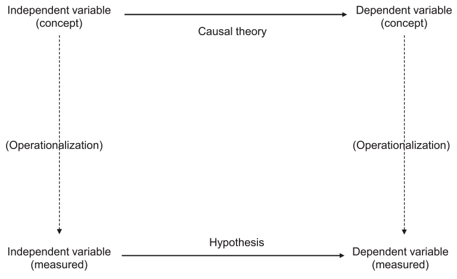



## So far, we've mostly covered hammers

{fig-align="center"}

# This week is about nails

(and by nails I mean theories)

## Lawyers and scientists

- Both start from a particular point of view (my client is innocent; my theory is correct)
- But they move in **opposite** directions from there:
  - Lawyers look for the evidence that is most likely to win them the case
  - Scientists look for the evidence that is most likely to **disprove** their theory
- Theories are never *proven,* only *supported*
- Ruthless criticism is scientists' love language 🥲

## In this class, you are a scientist

- Your research proposal is due next Friday!
- You will be stating a research question, identifying independent and dependent variables, and formulating a hypothesis your study will test
- This week, we are covering how to do all of that

## The scientific method

1. Develop a **theory**
2. General **hypotheses**
3. Conduct empirical **tests**
4. **Evaluate** hypotheses
5. Evaluate the theory

## We start with a theory

- A conjecture about the causes of some outcome of interest
  - Tentative
  - Generally causal
  - About something interesting
- Consists of an **independent variable,** a **dependent variable,** and the nature of the relationship between them

:::{.fragment}
> Example: "Better economic performance causes greater support for incumbents."

:::

## From concepts to measures

> "Better economic performance causes greater support for incumbents."

- What is our independent variable?
- What is our dependent variable?
- How could we **operationalize** each of these concepts?

## From theory to hypothesis



## Option 1

```{r}

```

## Option 2

```{r}

```


## Revisiting a theory from last week

:::{.fragment}
> "As countries develop economically, citizens start demanding more democracy."

:::

- What hypotheses can we derive from this theory?
- What are our independent and dependent variables, conceptually?
- How could we measure these concepts?
  - In a perfect world?
  - With limited access, funding, and time?

## Revisiting our Polity dataset

```{webr}
happiness_data <- read.csv('happiness_polity_2018.csv')
head(happiness_data)
```

- How could we operationalize the concepts of economic development and democracy?
- What are the advantages of these operationalizations?
- What are their weaknesses?
