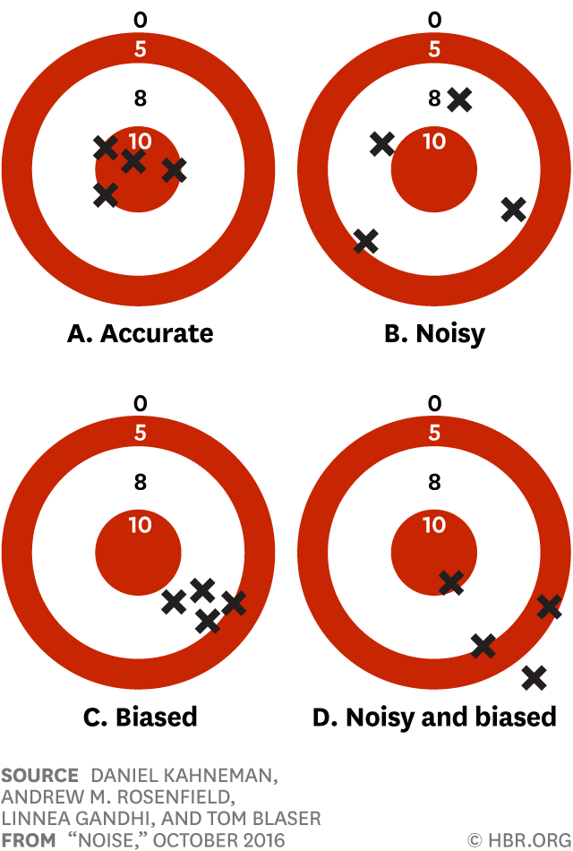



## Happiness measure #1

> Please imagine a ladder with steps numbered from 0 at the bottom to 10 at the top. The top of the ladder represents the best possible life for you and the bottom of the ladder represents the worst possible life for you. On which step of the ladder would you say you personally feel you stand at this time?

## Happiness measure #2

> Taking all things together, would you say you are (1) very happy, (2) quite happy, (3) not very happy or (4) not at all happy?

## The happiest countries

```{r}
library(dplyr)
library(knitr)
library(kableExtra)
happiness <- read.csv("happiness-wvs-vs-gallup.csv") %>%
  filter(Year==2022) %>%
  filter(!is.na(Self.reported.life.satisfaction..Cantril.Ladder.) & !is.na(Share.of.people.who.say.they.are..very.happy..or..rather.happy...IVS.)) %>%
  select(c(Entity, Self.reported.life.satisfaction..Cantril.Ladder., Share.of.people.who.say.they.are..very.happy..or..rather.happy...IVS.)) %>%
  rename(Country = Entity,
         happiness1 = Self.reported.life.satisfaction..Cantril.Ladder.,
         happiness2 = Share.of.people.who.say.they.are..very.happy..or..rather.happy...IVS.)
```

:::{.columns}
:::{.column width=50%}
```{r}
happiness %>%
  select(Country, happiness1) %>%
  arrange(desc(happiness1)) %>%
  head(n = 10)
```
:::
:::{.column width=50%}
:::{.fragment}
```{r}
happiness %>%
  select(Country, happiness2) %>%
  arrange(desc(happiness2)) %>%
  head(n = 10)
```
:::
:::
:::

## Who is *actually* the happiest?

```{r}
library(ggplot2)
happiness %>%
  arrange(desc(happiness1)) %>%
  mutate(ladder_ranking = row_number()) %>%
  arrange(desc(happiness2)) %>%
  mutate(how_happy_ranking = row_number()) %>%
  ggplot(aes(x = ladder_ranking, y = how_happy_ranking)) +
  geom_point() +
  geom_smooth(method = "lm", level = F) +
  theme(text = element_text(size = 20))
```

## We can *operationalize* happiness differently

- Option 1: life satisfaction
- Option 2: feeling positive emotions
- Option 3: a sense of meaning and purpose
- *Which matters more, when?*

:::{.fragment}
Operationalization is difficult and important!
:::

# What makes a good measure?

## Criterion 1: Reliability

- **Reliability:** freedom from *random* error
- Consistency over time
- Consistency across multiple **items** that form a single **measure**

## Criterion 2: Validity

- **Validity:** freedom from *systematic* error
- Validity includes multiple considerations...

## Face validity

- Does the measure superficially seem to capture the concept?

:::{.fragment}
> Please imagine a ladder with steps numbered from 0 at the bottom to 10 at the top. The top of the ladder represents the best possible life for you and the bottom of the ladder represents the worst possible life for you. On which step of the ladder would you say you personally feel you stand at this time?

:::

## Content validity

- Does the measure cover all important aspects of the concept?
- *e.g.,* Polity scores include presence of elections, but also...
  - Constraints on executive authority
  - Political participation
  - Political competition

## Criterion validity

- Does the measure relate to other well-established measures that it *should* relate to?
- **Concurrent** criterion validity: a new measure of happiness should be correlated with an established measure of happiness included on the same survey.
- **Predictive** criterion validity: dissatisfaction with democracy today predicts participating in a protest next year (need multiple surveys of the same people to establish this)

## Construct validity

- Does the measure fit into the broader network of measures the way it should?
- **Convergent** construct validity: political knowledge should be correlated with news consumption, education, and political interest
- **Discriminant** construct validity: political knowledge should **not** be synonymous with general verbal ability or intelligence, and confident guessers shouldn't score better

## Bias and noise

{fig-align="center"}

# Writing effective questions

## Know what you are measuring

- Attitudes
- Knowledge
- Skills
- Intentions and aspirations
- Behaviors and practices
- *Perceptions* of knowledge, skills, or behavior

## Consider methods of measurement

- Fixed-response options
  - Yes/no
  - True/false
  - **Likert scale**
  - Rank ordering
  - Multiple choice
- Open-ended

:::{.fragment}
*Think about how you will analyze the data you collect in advance.*
:::

## Present the right amount of information

- Avoid jargon, acronyms and assuming specific knowledge
- But don't provide **too** much context either
- Use language that is clear and specific
- Keep wording concise

## Avoid leading questions

> "In addition to the previous United Nations scandal involving mismanagement of the Oil-for-Food program, there are now indications of corruption in the handling of the peacekeeping activities. Do you think the United States should stop paying dues to the United Nations until its problems of mismanagement are cleaned up?"

- Primes considerations of past events
- Pushes support for a change

## This is better

> "Under the current law, health insurers are not allowed to charge higher prices to --- or refuse to cover --- people who have pre-existing health conditions.
>
> Do you favor or oppose this provision of the current law?"

- Avoids jargon
- Provides relevant background
- Presents response options neutrally

## Present balanced alternatives

- People want to be agreeable $\rightarrow$ **acquiescence bias**

:::{.fragment}
> "Do you agree or disagree: The best way to ensure peace is through military strength"

:::

:::{.fragment}
> "Which statement comes closer to your views: (a) The best way to ensure peace is through military strength, or (b) Diplomacy is the best way to ensure peace?

:::

## Consider question order

- Start with non-threatening questions
- But also, put the most important questions near the beginning
- Beware **priming** effects

## Ask about one thing at a time

- Avoid **double-barreled questions**

:::{.fragment}
> "How much confidence do you have in President Trump to handle domestic and foreign policy?"

:::
  
## Know your population

- Age
- Education level
- Familiarity with tests and questionnaires
- Cultural/language differences
- Conduct a **pilot** and/or **cognitive interviews**

## Don't reinvent the wheel

- Many major survey firms post their questions publicly!
  - American National Election Survey [question search](https://electionstudies.org/data-tools/anes-question-search/)
  - Cooperative Election Study [question search](https://cooperativeelectionstudy.shinyapps.io/ccsearch/)
  - Roper iPoll [question search](https://ropercenter.cornell.edu/ipoll/)
- For specific questions, search the academic literature too

# Today's activity